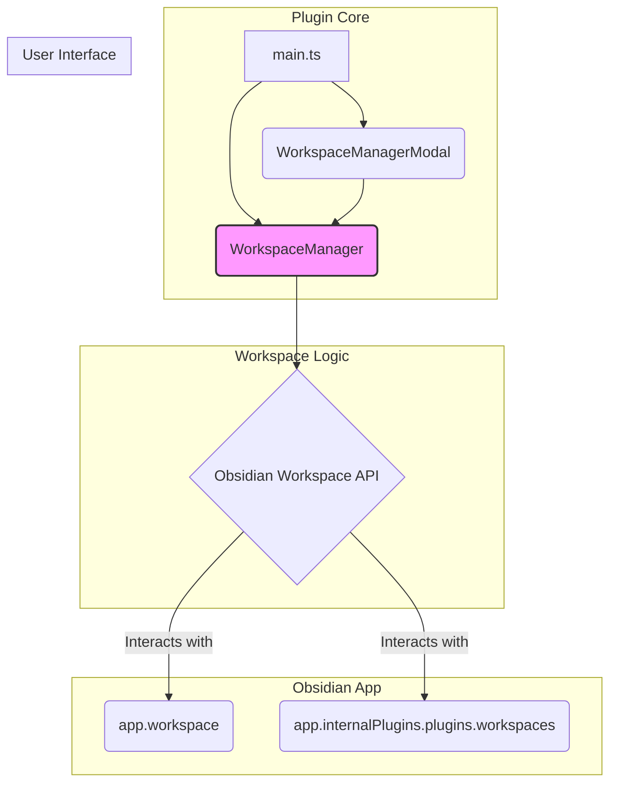

# Workspace Manager Refactoring Plan

This document outlines the plan to re-architect the Workspace Manager plugin to use the official Obsidian Workspace API, moving away from direct manipulation of the `workspaces.json` file.

## 1. Current Architecture Analysis

*   **`WorkspaceManager.ts`**: The current core logic directly reads, modifies, and writes the `.obsidian/workspaces.json` file. This is the primary cause of instability.
*   **`WorkspaceManagerModal.ts`**: The UI is tightly coupled to the file-based `WorkspaceManager`.
*   **`main.ts`**: The plugin entry point.
*   **`types.ts`**: Defines data structures that mirror the `workspaces.json` file.

## 2. Proposed New Architecture

The new architecture will use the official Obsidian Workspace API. `WorkspaceManager` will become a high-level controller that uses the API.

## 3. Detailed Refactoring Plan

### Step 1: Refactor `WorkspaceManager.ts`

*   **Remove Direct File I/O**: Eliminate methods like `getWorkspaces`, `saveWorkspaces`, `createBackup`, `writeAtomically`, and the transaction system.
*   **Implement API-Centric Methods**:
    *   `getWorkspaceList()`: Fetches workspace names from the API.
    *   `getFilesInWorkspace(workspaceName: string): Promise<string[]>`: Loads a workspace to inspect its open files, then restores the original workspace.
    *   `reorganizeWorkspace(workspaceName: string, filesToAdd: string[], filesToRemove: string[])`: The core method for all modifications. It will load a workspace, add/remove files by opening/closing leaves, and then save the workspace.
    *   `deleteWorkspace(workspaceName: string)`: Deletes a workspace using the API.
    *   `renameWorkspace(oldName: string, newName: string)`: Saves the current layout under a new name and deletes the old one.

### Step 2: Update `types.ts`

*   Deprecate or remove the complex interfaces that mirror `workspaces.json`.
*   Rely on Obsidian's built-in types where possible.

### Step 3: Update `WorkspaceManagerModal.ts`

*   Update the modal to use the new `WorkspaceManager` methods.
*   The UI will display a list of open files for the selected workspace.
*   Re-wire the "Move", "Copy", and "Delete" actions to use `reorganizeWorkspace`.

### Step 4: Update `main.ts`

*   Update the initialization of `WorkspaceManager` to reflect its new, simpler constructor.

This plan will result in a more stable and maintainable plugin that aligns with Obsidian's best practices.