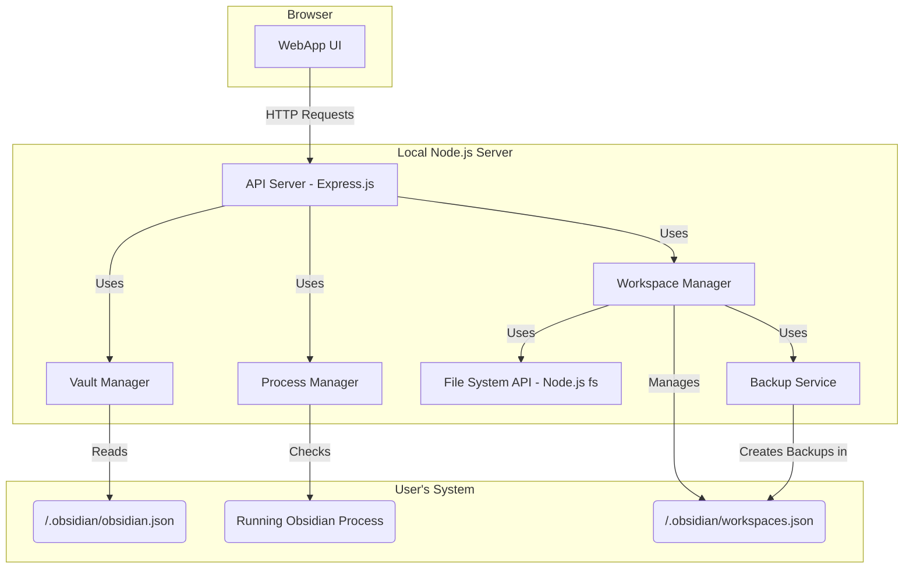

# Offline Workspace Manager - Implementation Plan

## 1. Overview

The Offline Workspace Manager is a standalone local web application designed to safely edit Obsidian workspace configurations when the main Obsidian application is closed. It provides a user-friendly interface to manage tabs between different workspaces within a vault, addressing the need for offline workspace management.

The tool's primary goal is to provide powerful workspace editing capabilities while ensuring the integrity of the user's data through robust backup mechanisms, atomic file operations, and explicit checks to prevent conflicts with a running Obsidian instance.

## 2. Architecture

The tool will be a local client-server application. A lightweight Node.js backend will handle all file system interactions, business logic, and serve a simple, modern web interface to the browser.



### Core Components

*   **Backend (Node.js/Express):** A server responsible for all logic that requires access to the local file system.
    *   **API Server:** Exposes endpoints for the frontend to interact with, such as listing vaults, getting workspace data, and performing move/copy operations.
    *   **Vault Manager:** Locates the Obsidian configuration file (`obsidian.json`) on the user's system to discover recently opened vaults.
    *   **Process Manager:** Detects if the Obsidian application is currently running to prevent data corruption from simultaneous file access.
    *   **Workspace Manager:** The core logic engine adapted from the original plugin. It handles reading, parsing, modifying, and writing `workspaces.json`. It orchestrates the backup and file writing process.
    *   **Backup Service:** Manages the creation and pruning of timestamped backups for `workspaces.json`, mirroring the reliable strategy from the original `WORKPLAN.md`.

*   **Frontend (HTML/CSS/JavaScript):** A single-page application (SPA) that provides the user interface.
    *   **UI Components:** A set of simple, reactive components for displaying vaults, workspaces, and tabs, and for triggering actions.
    *   **API Client:** A service layer for making requests to the backend Node.js server.

## 3. Data Models

The data models for `workspaces.json` are critical and will be identical to those defined in the original plugin's `WORKPLAN.md`. This ensures perfect compatibility.

```typescript
// Represents the entire workspaces.json file
export interface WorkspacesData {
  workspaces: Record<string, WorkspaceLayout>;
  active: string;
}

// Represents a single workspace's layout
export interface WorkspaceLayout {
  main: LayoutComponent;
  left?: LayoutComponent;
  right?: LayoutComponent;
  active: string;
  mtime: string;
}

// Represents a component in the layout (split, tabs, or leaf)
export interface LayoutComponent {
  id: string;
  type: "split" | "tabs" | "leaf";
  children?: LayoutComponent[];
  state?: LeafState;
  direction?: "horizontal" | "vertical";
  // ... other properties
}

// Represents the state of a single tab (leaf)
export interface LeafState {
  type: string;
  state: {
    file?: string;
    [key: string]: any;
  };
  icon?: string;
  title?: string;
}

// A simplified representation of a tab for the UI
export interface TabInfo {
  id: string;       // The leaf ID
  filePath: string; // The file path of the tab
  title: string;    // The displayed title
}
```

## 4. Implementation Roadmap

The project will be developed in a new `offline-manager` directory.

### Phase 1: Backend Foundation

1.  **Project Setup:**
    *   Initialize a Node.js project with TypeScript.
    *   Set up an Express.js server.
2.  **Vault & Process Detection:**
    *   Implement `VaultManager` to find and parse `obsidian.json` for different operating systems (macOS, Windows, Linux).
    *   Implement `ProcessManager` to detect a running Obsidian process.
    *   Create API endpoints: `GET /api/vaults` and `GET /api/obsidian-status`.
3.  **Core Workspace Logic:**
    *   Port the `WorkspaceManager` class from the original plan.
    *   Adapt file system access to use Node's `fs/promises` API.
    *   Implement `getWorkspaces(vaultPath)`.
    *   Create the `GET /api/workspaces?vaultPath=...` endpoint.

### Phase 2: Frontend & Core Functionality

1.  **Frontend Setup:**
    *   Initialize a frontend project (e.g., using Vite with vanilla TypeScript).
    *   Structure the UI with placeholders for each section.
2.  **UI Implementation:**
    *   On startup, call the backend to check Obsidian's status and fetch the vault list.
    *   Display a warning if Obsidian is running.
    *   Populate the vault selection UI.
    *   On vault selection, fetch and display the list of source workspaces.
    *   On workspace selection, display all its tabs with checkboxes.
    *   Populate the target workspace dropdown.
3.  **Tab Operations Logic:**
    *   Implement the `moveTabs` and `copyTabs` logic within the backend `WorkspaceManager`. This includes finding, removing, and adding tab data between workspaces.
    *   Create the backend API endpoints: `POST /api/workspaces/move` and `POST /api/workspaces/copy`.

### Phase 3: Safety Mechanisms & Finalization

1.  **Data Safety Implementation:**
    *   Integrate the `createBackup` and `writeAtomically` methods into the `moveTabs` and `copyTabs` flows on the backend.
    *   Implement the transaction logic: `beginTransaction` (backup), `commitTransaction` (cleanup), `rollbackTransaction` (restore from backup on error).
2.  **Connecting UI to Logic:**
    *   Wire the "Move Tabs" and "Copy Tabs" buttons on the frontend to their respective backend API endpoints.
    *   Provide clear feedback to the user (e.g., "Success!", "Error: ...").
3.  **Styling and UX:**
    *   Apply CSS to create a clean, intuitive layout.
    *   Ensure the application is easy to navigate and understand.

### Phase 4: Testing and Documentation

1.  **Testing:**
    *   Write unit tests for the backend `WorkspaceManager` logic.
    *   Perform manual end-to-end testing based on the checklist below.
2.  **Documentation:**
    *   Create a `README.md` with clear instructions on how to install dependencies (`npm install`) and run the application (`npm start`).

### Phase 5: Desktop App Packaging (Post-MVP)

1.  **Framework Integration:**
    *   Integrate a desktop app framework like Electron or Tauri into the project.
    *   Configure build scripts for macOS, Windows, and Linux.
2.  **Application Shell:**
    *   Create the main application window and menu.
    *   Ensure the Node.js server starts and stops with the application lifecycle.
3.  **Build and Sign:**
    *   Implement scripts to build the final application bundles (`.app`, `.exe`).
    *   (Optional) Set up code signing for macOS and Windows to avoid security warnings.

## 6. Data Safety Mechanisms

Data integrity is paramount. This tool will adopt the proven safety mechanisms from the original plugin plan.

1.  **Prerequisite Check:** The application will refuse to modify files if it detects that Obsidian is running, preventing race conditions and data corruption.
2.  **Transactional Operations:** All file modifications are wrapped in a transaction. A backup of `workspaces.json` is created before the operation begins. If any step fails, the entire operation is aborted, and the original file is restored from the backup.
3.  **Atomic Writes:** To prevent file corruption during a crash or interruption, writes will be performed atomically:
    1.  Write the new content to a temporary file (e.g., `workspaces.json.tmp`).
    2.  Verify the temporary file is valid.
    3.  Rename the temporary file to `workspaces.json`, which is an atomic operation on most file systems.

## 7. Testing & Evaluation Strategy

### Backend Unit Tests

Unit tests will be written for the `WorkspaceManager` using a framework like Jest, covering:
*   Correctly parsing various `workspaces.json` structures.
*   Extracting tabs from simple and complex layouts.
*   Moving and copying tabs between workspaces.
*   Ensuring backups are created.
*   Verifying that rollback restores the original file on error.

### Manual Testing Checklist

1.  **Setup & Detection:**
    *   [ ] App correctly finds and lists all recent Obsidian vaults.
    *   [ ] App correctly detects when Obsidian is running and shows a warning.
    *   [ ] App correctly detects when Obsidian is closed.
2.  **UI & Data Loading:**
    *   [ ] Selecting a vault correctly loads its list of workspaces.
    *   [ ] Selecting a source workspace displays an accurate list of its open tabs.
    *   [ ] The target workspace dropdown is populated correctly and excludes the source workspace.
3.  **Core Functionality:**
    *   [ ] Selecting multiple tabs and clicking "Copy" adds them to the target workspace without removing them from the source.
    *   [ ] Selecting multiple tabs and clicking "Move" adds them to the target workspace and removes them from the source.
    *   [ ] A backup file (`workspaces-backup-YYYY-MM-DDTHH-mm-ss-SSSZ.json`) is created in the vault's `.obsidian/backups` directory after a successful operation.
4.  **Edge Cases & Error Handling:**
    *   [ ] Attempting an action with no tabs selected shows a warning.
    *   [ ] The tool handles vaults with no `workspaces.json` file gracefully.
    *   [ ] The tool handles workspaces with no open tabs.
    *   [ ] File permission errors are caught and reported to the user.