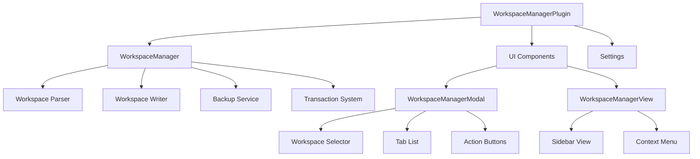

# Obsidian Workspace Manager Plugin - Implementation Plan

## Overview

The Obsidian Workspace Manager plugin will allow users to move and delete open files between workspaces by directly editing the `.obsidian/workspaces.json` file. The plugin will provide an intuitive UI for managing workspaces and ensure data safety through robust backup and validation mechanisms.

## Architecture



## Core Components

### 1. Data Models

```typescript
// Complete data model matching workspaces.json structure
export interface WorkspacesData {
  workspaces: Record<string, WorkspaceLayout>;
  active: string;
}

export interface WorkspaceLayout {
  main: LayoutComponent;
  left?: LayoutComponent;
  right?: LayoutComponent;
  active: string;
  mtime: string;
  "workspaces-plus:settings-v1"?: any;
}

export interface LayoutComponent {
  id: string;
  type: "split" | "tabs" | "leaf";
  children?: LayoutComponent[];
  state?: LeafState;
  direction?: "horizontal" | "vertical";
  width?: number;
  collapsed?: boolean;
  currentTab?: number;
}

export interface LeafState {
  type: string;
  state: {
    file?: string;
    mode?: string;
    source?: boolean;
    [key: string]: any;
  };
  icon?: string;
  title?: string;
}

// Simplified tab representation for UI
export interface TabInfo {
  id: string;
  workspaceName: string;
  filePath: string;
  title: string;
  type: string;
  icon?: string;
}
```

### 2. Workspace Manager

The `WorkspaceManager` class will handle all operations related to workspaces:

```typescript
export class WorkspaceManager {
    private transactionBackupPath: string | null = null;
    
    constructor(private app: App, private plugin: Plugin) {}
    
    // Read workspaces.json
    async getWorkspaces(): Promise<WorkspacesData> {
        try {
            const workspaceFile = await this.app.vault.adapter.read('.obsidian/workspaces.json');
            return JSON.parse(workspaceFile);
        } catch (error) {
            new Notice('Could not read workspaces file');
            console.error(error);
            return { workspaces: {}, active: '' };
        }
    }
    
    // Save workspaces.json with backup
    async saveWorkspaces(workspacesData: WorkspacesData): Promise<void> {
        try {
            // Create backup first
            await this.createBackup();
            
            const jsonString = JSON.stringify(workspacesData, null, 2);
            await this.writeAtomically('.obsidian/workspaces.json', jsonString);
            
            new Notice('Workspaces updated successfully');
        } catch (error) {
            new Notice('Failed to save workspaces');
            console.error(error);
            throw error;
        }
    }
    
    // Create a backup of workspaces.json
    async createBackup(): Promise<string> {
        const timestamp = new Date().toISOString().replace(/[:.]/g, '-');
        const backupFolder = this.plugin.settings.backupLocation || '.obsidian/backups';
        const backupName = `${backupFolder}/workspaces-backup-${timestamp}.json`;
        
        try {
            // Ensure backup folder exists
            await this.ensureFolder(backupFolder);
            
            // Create backup
            const currentWorkspaces = await this.app.vault.adapter.read('.obsidian/workspaces.json');
            await this.app.vault.adapter.write(backupName, currentWorkspaces);
            
            // Prune old backups
            await this.pruneOldBackups();
            
            return backupName;
        } catch (error) {
            console.warn('Could not create backup:', error);
            throw error;
        }
    }
    
    // Extract tabs from a workspace
    extractTabsFromWorkspace(workspace: WorkspaceLayout): TabInfo[] {
        const tabs: TabInfo[] = [];
        
        // Recursively extract tabs from Obsidian's layout structure
        const extractFromNode = (node: LayoutComponent) => {
            if (node.type === 'leaf' && node.state?.state?.file) {
                tabs.push({
                    id: node.id,
                    workspaceName: '',
                    filePath: node.state.state.file,
                    title: node.state.title || node.state.state.file.split('/').pop() || '',
                    type: node.state.type || 'markdown',
                    icon: node.state.icon
                });
            } else if (node.children) {
                node.children.forEach(extractFromNode);
            }
        };
        
        if (workspace.main) {
            extractFromNode(workspace.main);
        }
        
        return tabs;
    }
    
    // Move tabs between workspaces
    async moveTabsBetweenWorkspaces(
        sourceWorkspaceName: string,
        targetWorkspaceName: string,
        tabIds: string[]
    ): Promise<boolean> {
        try {
            // Begin transaction
            await this.beginTransaction();
            
            // Load workspaces
            const workspacesData = await this.getWorkspaces();
            
            // Validate workspaces exist
            if (!workspacesData.workspaces[sourceWorkspaceName] || 
                !workspacesData.workspaces[targetWorkspaceName]) {
                throw new Error('Source or target workspace not found');
            }
            
            // Find tabs in source workspace
            const sourceWorkspace = workspacesData.workspaces[sourceWorkspaceName];
            const targetWorkspace = workspacesData.workspaces[targetWorkspaceName];
            
            // For each tab to move
            for (const tabId of tabIds) {
                // Find the tab in the source workspace
                const tabInfo = this.findTabInWorkspace(sourceWorkspace, tabId);
                
                if (!tabInfo) {
                    console.warn(`Tab ${tabId} not found in workspace ${sourceWorkspaceName}`);
                    continue;
                }
                
                // Remove tab from source
                this.removeTabFromWorkspace(sourceWorkspace, tabId);
                
                // Add tab to target
                this.addTabToWorkspace(targetWorkspace, tabInfo.tab, tabInfo.parent);
            }
            
            // Update timestamps
            sourceWorkspace.mtime = new Date().toISOString();
            targetWorkspace.mtime = new Date().toISOString();
            
            // Save changes
            await this.saveWorkspaces(workspacesData);
            
            // Commit transaction
            await this.commitTransaction();
            
            return true;
        } catch (error) {
            // Rollback on error
            await this.rollbackTransaction();
            console.error('Failed to move files:', error);
            new Notice(`Failed to move files: ${error.message}`);
            return false;
        }
    }
    
    // Transaction methods
    async beginTransaction(): Promise<void> {
        // Create a backup before starting transaction
        this.transactionBackupPath = await this.createBackup();
    }
    
    async commitTransaction(): Promise<void> {
        // Clear the transaction backup
        this.transactionBackupPath = null;
    }
    
    async rollbackTransaction(): Promise<void> {
        if (!this.transactionBackupPath) {
            console.warn('No transaction backup to restore');
            return;
        }
        
        try {
            // Restore from backup
            const backupContent = await this.app.vault.adapter.read(this.transactionBackupPath);
            await this.app.vault.adapter.write('.obsidian/workspaces.json', backupContent);
            this.transactionBackupPath = null;
        } catch (error) {
            console.error('Failed to rollback transaction:', error);
            throw new Error(`Failed to rollback: ${error.message}`);
        }
    }
    
    // Utility methods
    private async writeAtomically(path: string, data: string): Promise<void> {
        const tempPath = `${path}.tmp`;
        
        try {
            // Write to temporary file first
            await this.app.vault.adapter.write(tempPath, data);
            
            // Validate the written data
            const writtenData = await this.app.vault.adapter.read(tempPath);
            this.validateData(writtenData, data);
            
            // Create backup of original file if it exists
            if (await this.app.vault.adapter.exists(path)) {
                const backupPath = `${path}.bak`;
                const originalData = await this.app.vault.adapter.read(path);
                await this.app.vault.adapter.write(backupPath, originalData);
            }
            
            // Rename temp file to target file
            if (await this.app.vault.adapter.exists(path)) {
                await this.app.vault.adapter.remove(path);
            }
            await this.app.vault.adapter.rename(tempPath, path);
            
        } catch (error) {
            // Clean up temp file if it exists
            if (await this.app.vault.adapter.exists(tempPath)) {
                await this.app.vault.adapter.remove(tempPath);
            }
            
            throw error;
        }
    }
    
    private validateData(written: string, expected: string): void {
        // Simple validation - check if the written data is valid JSON
        try {
            JSON.parse(written);
        } catch (error) {
            throw new Error(`Data validation failed: ${error.message}`);
        }
    }
    
    private async ensureFolder(path: string): Promise<void> {
        if (!(await this.app.vault.adapter.exists(path))) {
            await this.app.vault.adapter.mkdir(path);
        }
    }
}
```

### 3. UI Components

#### Workspace Manager Modal

```typescript
import { Modal, Setting } from 'obsidian';

export class WorkspaceManagerModal extends Modal {
    private sourceWorkspace: string;
    private targetWorkspace: string;
    private selectedTabs: string[] = [];
    private workspaceManager: WorkspaceManager;
    
    constructor(app: App, workspaceManager: WorkspaceManager) {
        super(app);
        this.workspaceManager = workspaceManager;
    }
    
    async onOpen() {
        const { contentEl } = this;
        contentEl.empty();
        contentEl.addClass('workspace-manager-modal');
        
        contentEl.createEl('h2', { text: 'Workspace Manager' });
        
        // Load workspaces
        const workspacesData = await this.workspaceManager.getWorkspaces();
        const workspaceNames = Object.keys(workspacesData.workspaces);
        
        if (workspaceNames.length === 0) {
            contentEl.createEl('p', { text: 'No workspaces found.' });
            return;
        }
        
        // Source workspace selector
        new Setting(contentEl)
            .setName('Source Workspace')
            .setDesc('Select the workspace to move files from')
            .addDropdown(dropdown => {
                workspaceNames.forEach(name => dropdown.addOption(name, name));
                dropdown.onChange(value => {
                    this.sourceWorkspace = value;
                    this.updateTabsList();
                });
                this.sourceWorkspace = workspaceNames[0];
                dropdown.setValue(this.sourceWorkspace);
            });
            
        // Target workspace selector
        new Setting(contentEl)
            .setName('Target Workspace')
            .setDesc('Select the workspace to move files to')
            .addDropdown(dropdown => {
                workspaceNames.forEach(name => dropdown.addOption(name, name));
                dropdown.onChange(value => {
                    this.targetWorkspace = value;
                });
                // Set default to second workspace or first if only one exists
                this.targetWorkspace = workspaceNames.length > 1 ? workspaceNames[1] : workspaceNames[0];
                dropdown.setValue(this.targetWorkspace);
            });
            
        // Container for tabs list
        const tabsContainer = contentEl.createDiv({ cls: 'workspace-manager-tabs' });
        
        // Buttons
        const buttonContainer = contentEl.createDiv({ cls: 'workspace-manager-buttons' });
        
        buttonContainer.createEl('button', { text: 'Move Selected', cls: 'mod-cta' })
            .addEventListener('click', async () => {
                if (this.sourceWorkspace === this.targetWorkspace) {
                    new Notice('Source and target workspaces must be different');
                    return;
                }
                
                if (this.selectedTabs.length === 0) {
                    new Notice('No tabs selected');
                    return;
                }
                
                const success = await this.workspaceManager.moveTabsBetweenWorkspaces(
                    this.sourceWorkspace,
                    this.targetWorkspace,
                    this.selectedTabs
                );
                
                if (success) {
                    new Notice(`Moved ${this.selectedTabs.length} tabs to ${this.targetWorkspace}`);
                    this.close();
                }
            });
            
        buttonContainer.createEl('button', { text: 'Delete Selected' })
            .addEventListener('click', async () => {
                if (this.selectedTabs.length === 0) {
                    new Notice('No tabs selected');
                    return;
                }
                
                const confirmed = await this.confirmDeletion();
                if (!confirmed) return;
                
                const success = await this.workspaceManager.deleteTabsFromWorkspace(
                    this.sourceWorkspace,
                    this.selectedTabs
                );
                
                if (success) {
                    new Notice(`Deleted ${this.selectedTabs.length} tabs from ${this.sourceWorkspace}`);
                    this.updateTabsList();
                }
            });
            
        buttonContainer.createEl('button', { text: 'Cancel' })
            .addEventListener('click', () => this.close());
            
        // Initial tabs list
        this.updateTabsList();
    }
    
    async updateTabsList() {
        const tabsContainer = this.contentEl.querySelector('.workspace-manager-tabs');
        if (!tabsContainer) return;
        
        tabsContainer.empty();
        
        const workspacesData = await this.workspaceManager.getWorkspaces();
        const workspace = workspacesData.workspaces[this.sourceWorkspace];
        
        if (!workspace) {
            tabsContainer.createEl('p', { text: 'Workspace not found' });
            return;
        }
        
        const tabs = this.workspaceManager.extractTabsFromWorkspace(workspace);
        
        if (tabs.length === 0) {
            tabsContainer.createEl('p', { text: 'No tabs in this workspace' });
            return;
        }
        
        // Reset selected tabs
        this.selectedTabs = [];
        
        // Create checkbox for each tab
        tabs.forEach(tab => {
            new Setting(tabsContainer)
                .setName(tab.title)
                .setDesc(tab.filePath)
                .addToggle(toggle => {
                    toggle.onChange(value => {
                        if (value) {
                            this.selectedTabs.push(tab.id);
                        } else {
                            this.selectedTabs = this.selectedTabs.filter(id => id !== tab.id);
                        }
                    });
                });
        });
    }
    
    async confirmDeletion(): Promise<boolean> {
        return new Promise((resolve) => {
            const modal = new Modal(this.app);
            modal.contentEl.createEl('h2', { text: 'Confirm Deletion' });
            modal.contentEl.createEl('p', { 
                text: `Are you sure you want to delete ${this.selectedTabs.length} tabs from the "${this.sourceWorkspace}" workspace?` 
            });
            
            const buttonContainer = modal.contentEl.createDiv({ cls: 'workspace-manager-buttons' });
            
            buttonContainer.createEl('button', { text: 'Delete', cls: 'mod-warning' })
                .addEventListener('click', () => {
                    modal.close();
                    resolve(true);
                });
                
            buttonContainer.createEl('button', { text: 'Cancel' })
                .addEventListener('click', () => {
                    modal.close();
                    resolve(false);
                });
                
            modal.open();
        });
    }
    
    onClose() {
        const { contentEl } = this;
        contentEl.empty();
    }
}
```

### 4. Plugin Main Class

```typescript
import { Plugin, PluginSettingTab, App, Setting } from 'obsidian';
import { WorkspaceManager } from './workspace-manager';
import { WorkspaceManagerModal } from './workspace-manager-modal';

interface WorkspaceManagerSettings {
    backupLocation: string;
    maxBackups: number;
    confirmDeletion: boolean;
}

const DEFAULT_SETTINGS: WorkspaceManagerSettings = {
    backupLocation: '.obsidian/plugins/workspace-manager/backups',
    maxBackups: 10,
    confirmDeletion: true
};

export default class WorkspaceManagerPlugin extends Plugin {
    settings: WorkspaceManagerSettings;
    workspaceManager: WorkspaceManager;
    
    async onload() {
        console.log('Loading Workspace Manager plugin');
        
        await this.loadSettings();
        
        this.workspaceManager = new WorkspaceManager(this.app, this);
        
        // Add ribbon icon
        this.addRibbonIcon('folder', 'Workspace Manager', () => {
            new WorkspaceManagerModal(this.app, this.workspaceManager).open();
        });
        
        // Add command
        this.addCommand({
            id: 'open-workspace-manager',
            name: 'Open Workspace Manager',
            callback: () => {
                new WorkspaceManagerModal(this.app, this.workspaceManager).open();
            }
        });
        
        // Add settings tab
        this.addSettingTab(new WorkspaceManagerSettingTab(this.app, this));
    }
    
    onunload() {
        console.log('Unloading Workspace Manager plugin');
    }
    
    async loadSettings() {
        this.settings = Object.assign({}, DEFAULT_SETTINGS, await this.loadData());
    }
    
    async saveSettings() {
        await this.saveData(this.settings);
    }
}

class WorkspaceManagerSettingTab extends PluginSettingTab {
    plugin: WorkspaceManagerPlugin;
    
    constructor(app: App, plugin: WorkspaceManagerPlugin) {
        super(app, plugin);
        this.plugin = plugin;
    }
    
    display(): void {
        const { containerEl } = this;
        containerEl.empty();
        
        containerEl.createEl('h2', { text: 'Workspace Manager Settings' });
        
        new Setting(containerEl)
            .setName('Backup Location')
            .setDesc('Location to store workspace backups')
            .addText(text => text
                .setPlaceholder('.obsidian/plugins/workspace-manager/backups')
                .setValue(this.plugin.settings.backupLocation)
                .onChange(async (value) => {
                    this.plugin.settings.backupLocation = value;
                    await this.plugin.saveSettings();
                }));
                
        new Setting(containerEl)
            .setName('Max Backups')
            .setDesc('Maximum number of backups to keep')
            .addText(text => text
                .setPlaceholder('10')
                .setValue(String(this.plugin.settings.maxBackups))
                .onChange(async (value) => {
                    const numValue = parseInt(value);
                    if (!isNaN(numValue) && numValue > 0) {
                        this.plugin.settings.maxBackups = numValue;
                        await this.plugin.saveSettings();
                    }
                }));
                
        new Setting(containerEl)
            .setName('Confirm Deletion')
            .setDesc('Show confirmation dialog before deleting tabs')
            .addToggle(toggle => toggle
                .setValue(this.plugin.settings.confirmDeletion)
                .onChange(async (value) => {
                    this.plugin.settings.confirmDeletion = value;
                    await this.plugin.saveSettings();
                }));
    }
}
```

### 5. Styling

```css
/* styles.css */

.workspace-manager-modal {
    width: 500px;
    max-width: 100%;
}

.workspace-manager-tabs {
    max-height: 300px;
    overflow-y: auto;
    margin: 1rem 0;
    border: 1px solid var(--background-modifier-border);
    border-radius: 4px;
    padding: 0.5rem;
}

.workspace-manager-buttons {
    display: flex;
    justify-content: flex-end;
    gap: 0.5rem;
    margin-top: 1rem;
}

.workspace-manager-tab-item {
    display: flex;
    align-items: center;
    padding: 0.5rem;
    border-radius: 4px;
    margin-bottom: 0.5rem;
    background-color: var(--background-secondary);
}

.workspace-manager-tab-item:hover {
    background-color: var(--background-modifier-hover);
}

.workspace-manager-tab-icon {
    margin-right: 0.5rem;
    color: var(--text-muted);
}

.workspace-manager-tab-title {
    flex: 1;
    font-weight: 500;
}

.workspace-manager-tab-path {
    color: var(--text-muted);
    font-size: 0.8rem;
    margin-top: 0.2rem;
}
```

## Implementation Roadmap

### Phase 1: Foundation (Week 1)

1. **Project Setup**
   - Initialize plugin using Obsidian sample plugin template
   - Set up TypeScript configuration
   - Create basic folder structure
   - Add necessary dependencies

2. **Core Data Models**
   - Define interfaces for workspace data structures
   - Create utility functions for working with workspaces

3. **Basic Workspace Manager**
   - Implement reading and writing workspaces.json
   - Create simple backup functionality
   - Implement tab extraction from workspaces

### Phase 2: Core Functionality (Week 2)

4. **Tab Movement Logic**
   - Implement finding tabs in workspace structure
   - Create functions to remove tabs from workspaces
   - Implement adding tabs to workspaces
   - Test tab movement between workspaces

5. **Safety Mechanisms**
   - Implement transaction system
   - Add atomic write operations
   - Create validation functions
   - Enhance backup system

6. **Basic UI**
   - Create simple modal for workspace management
   - Implement workspace selection
   - Add tab listing functionality

### Phase 3: Enhanced Features (Week 3)

7. **Complete UI Implementation**
   - Implement tab selection and actions
   - Add confirmation dialogs
   - Create styling for UI components

8. **Plugin Settings**
   - Implement settings tab
   - Add backup configuration options
   - Create user preferences

9. **Testing and Debugging**
   - Create test fixtures
   - Implement unit tests
   - Perform manual testing
   - Fix bugs and edge cases

### Phase 4: Polish and Release (Week 4)

10. **Documentation**
    - Create user documentation
    - Add inline code comments
    - Create README with installation and usage instructions

11. **Final Testing**
    - Test on different Obsidian versions
    - Test with various workspace configurations
    - Ensure error handling works correctly

12. **Release Preparation**
    - Create release package
    - Update version information
    - Prepare for submission to Obsidian community plugins

## Testing Strategy

### Unit Tests

```typescript
// Example unit tests for WorkspaceManager
describe('WorkspaceManager', () => {
    let workspaceManager: WorkspaceManager;
    let mockApp: any;
    let mockPlugin: any;
    
    beforeEach(() => {
        // Setup mock app and plugin
        mockApp = {
            vault: {
                adapter: {
                    read: jest.fn(),
                    write: jest.fn(),
                    exists: jest.fn(),
                    remove: jest.fn(),
                    rename: jest.fn(),
                    mkdir: jest.fn(),
                    list: jest.fn()
                }
            }
        };
        
        mockPlugin = {
            settings: {
                backupLocation: '.obsidian/backups',
                maxBackups: 10
            }
        };
        
        workspaceManager = new WorkspaceManager(mockApp as any, mockPlugin as any);
    });
    
    describe('getWorkspaces', () => {
        it('should parse workspaces.json correctly', async () => {
            // Mock the read function to return a sample workspaces.json
            mockApp.vault.adapter.read.mockResolvedValue(JSON.stringify({
                workspaces: {
                    Test1: { main: { id: '1', type: 'split', children: [] } },
                    Test2: { main: { id: '2', type: 'split', children: [] } }
                },
                active: 'Test1'
            }));
            
            const result = await workspaceManager.getWorkspaces();
            
            expect(result).toHaveProperty('workspaces');
            expect(result.workspaces).toHaveProperty('Test1');
            expect(result.workspaces).toHaveProperty('Test2');
            expect(result.active).toBe('Test1');
        });
        
        it('should handle errors when reading workspaces.json', async () => {
            // Mock the read function to throw an error
            mockApp.vault.adapter.read.mockRejectedValue(new Error('File not found'));
            
            const result = await workspaceManager.getWorkspaces();
            
            expect(result).toHaveProperty('workspaces');
            expect(Object.keys(result.workspaces)).toHaveLength(0);
            expect(result.active).toBe('');
        });
    });
    
    describe('extractTabsFromWorkspace', () => {
        it('should extract tabs from a workspace', () => {
            const workspace = {
                main: {
                    id: 'main',
                    type: 'split',
                    children: [
                        {
                            id: 'tabs1',
                            type: 'tabs',
                            children: [
                                {
                                    id: 'leaf1',
                                    type: 'leaf',
                                    state: {
                                        type: 'markdown',
                                        state: {
                                            file: 'test.md',
                                            mode: 'source'
                                        },
                                        title: 'Test'
                                    }
                                }
                            ]
                        }
                    ]
                },
                active: 'leaf1',
                mtime: '2023-01-01T00:00:00Z'
            };
            
            const tabs = workspaceManager.extractTabsFromWorkspace(workspace);
            
            expect(tabs).toHaveLength(1);
            expect(tabs[0].id).toBe('leaf1');
            expect(tabs[0].filePath).toBe('test.md');
            expect(tabs[0].title).toBe('Test');
            expect(tabs[0].type).toBe('markdown');
        });
    });
});
```

### Manual Testing Checklist

1. **Basic Operations**
   - [ ] Read workspaces.json correctly
   - [ ] Display all workspaces and their tabs
   - [ ] Move a tab from one workspace to another
   - [ ] Delete a tab from a workspace
   - [ ] Create a backup before changes
   - [ ] Restore from a backup

2. **UI Testing**
   - [ ] Modal opens and displays correctly
   - [ ] Workspace selectors work as expected
   - [ ] Tab list displays accurately
   - [ ] Selection checkboxes work correctly
   - [ ] Action buttons perform the correct operations
   - [ ] Confirmation dialogs appear when needed

3. **Edge Cases**
   - [ ] Handle empty workspaces
   - [ ] Handle workspaces with complex layouts
   - [ ] Recover from corrupted workspaces.json
   - [ ] Handle non-existent files in workspaces

4. **Safety Features**
   - [ ] Backup is created before any changes
   - [ ] Transaction rollback works on error
   - [ ] Atomic write operations prevent corruption
   - [ ] Validation catches invalid data

## Data Safety Mechanisms

### 1. Automatic Backups

The plugin automatically creates backups before any changes to workspaces.json:
- Timestamped backups for easy identification
- Configurable backup location
- Automatic pruning of old backups

### 2. Transaction System

All operations that modify workspaces.json use a transaction system:
- Begin transaction creates a backup
- Commit transaction finalizes changes
- Rollback transaction restores from backup on error

### 3. Atomic Write Operations

File writes use an atomic pattern to prevent corruption:
- Write to temporary file first
- Validate written data
- Create backup of original file
- Replace original file with temporary file

### 4. Validation

Data is validated at multiple points:
- Before writing to ensure valid JSON
- After reading to ensure expected structure
- Before operations to ensure prerequisites are met

## Conclusion

This implementation plan provides a comprehensive roadmap for creating the Obsidian Workspace Manager plugin. By following this plan, developers can create a robust, user-friendly plugin that allows users to manage their workspaces effectively while ensuring data safety through multiple protection mechanisms.

The modular architecture and clear separation of concerns make the code maintainable and extensible, allowing for future enhancements and features to be added easily.